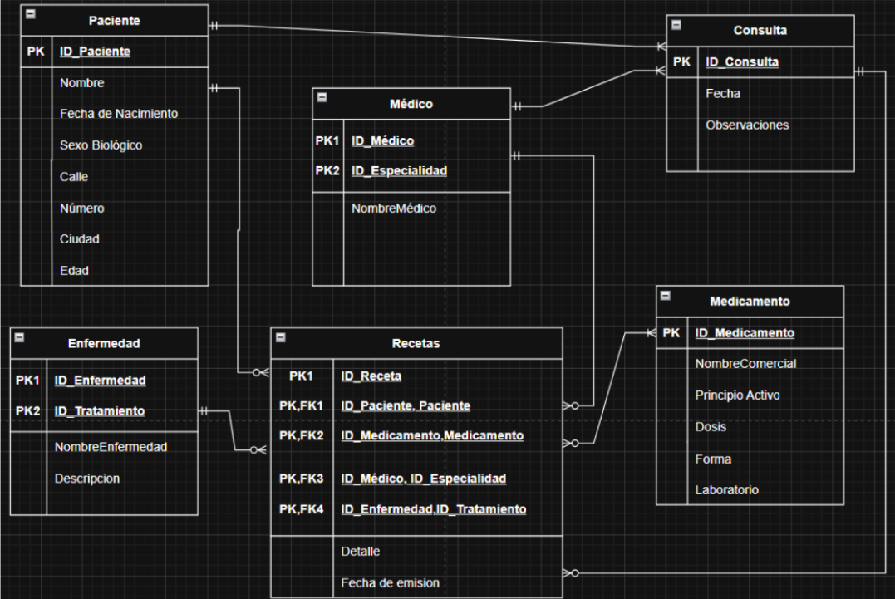
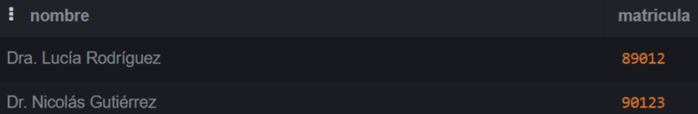

# Trabajo Práctico N°4

## _Autores:_ 
* Santiago Gruss
* Juan Agustín Martínez Haart

## **PARTE 1:** Bases de Datos

### 1. ¿Qué tipo de base de datos es? 

Para clasificar la base de datos, se considera:

Según su estructura (modelo de datos): Es una base de datos relacional. Porque la información se organiza en tablas que representan entidades (pacientes, médicos, recetas, consultas) relacionadas entre sí mediante claves primarias y foráneas.

Según su función o uso: Es una base de datos transaccional u operacional (OLTP – Online Transaction Processing). Se utiliza para registrar y gestionar la información diaria del centro médico: consultas, recetas, pacientes, estadísticas operativas.

Según su finalidad: Consideramos agregar esta clasificación porque nos parecía distintiva de la base de datos que estamos analizando, por lo tanto, según su finalidad es una base de datos administrativa / sanitaria enfocada en la gestión clínica y médica.

### 2. Armar el diagrama entidad-relación de la base de datos dada. 


### 3. Armar el Modelo relacional de la base de datos dada.


El modelo relacional que hemos planteado se definió previamente a través del Diagrama de Chen y con eso pudimos desarrollar la notación de Crow’s Foot. Con este último diseño buscamos reflejar la realidad operativa del “centro médico”, esperando integrar bien las referencias y la normalización de los datos.

La relación entre Paciente y Receta es de uno a muchos (1:N), ya que un paciente puede tener registradas múltiples recetas a lo largo del tiempo, pero cada receta pertenece a un solo paciente. Esta relación permite el seguimiento histórico de las prescripciones de un mismo individuo, asegurando que la trazabilidad se mantenga a lo largo del tiempo. Además, se establece que la Receta depende de la existencia de un paciente, por lo que se justifica que sea una entidad débil, cuya clave primaria incluye la clave del paciente.

De forma análoga, un Médico puede emitir muchas recetas, pero cada receta está asociada a un único médico que la emite. Por lo tanto, se establece una relación uno a muchos (1:N) desde Médico hacia Receta. Esta relación permite analizar la actividad médica por especialidad o por profesional, así como realizar auditorías de las prescripciones emitidas.
Cada Receta puede contener la prescripción de un medicamento o tratamiento específico. En este modelo se ha simplificado asumiendo que cada receta incluye un solo medicamento principal, por lo cual la relación es de muchos a uno (N:1) desde Receta hacia Medicamento. Esta decisión de diseño busca mantener la estructura del modelo simple y centrada en la trazabilidad de prescripciones, sin necesidad de incorporar una entidad intermedia que detalle múltiples medicamentos por receta (como “Detalle_Receta”), la cual fue descartada deliberadamente.

Cada Receta se asocia a una única enfermedad o diagnóstico que motiva la prescripción, mientras que una enfermedad puede estar vinculada a múltiples recetas emitidas en diferentes pacientes o momentos. Por tanto, la relación es uno a muchos (1:N) desde Enfermedad hacia Receta. Esta relación permite realizar análisis epidemiológicos, ya que posibilita relacionar las enfermedades más frecuentes con los medicamentos recetados o las especialidades médicas que las tratan.

Finalmente, la entidad Receta fue definida como entidad débil, ya que no tiene existencia independiente: depende tanto del Paciente como del Médico. Su clave primaria está compuesta por la combinación de las claves foráneas (IDPaciente, IDMedico, IDEnfermedad, IDMedicamento) junto con la Fecha de emisión, lo que garantiza la unicidad de cada registro sin necesidad de introducir un identificador nuevo.


### 4. Considera que la base de datos está normalizada. En caso que no lo esté, ¿cómo podría hacerlo?

En términos generales, consideramos que la base de datos propuesta se encuentra parcialmente normalizada, ya que las entidades principales (Paciente, Médico, Medicamento, Enfermedad, Receta, Consulta) están separadas correctamente y no se observan redundancias evidentes en su estructura conceptual.

Sin embargo, todavía no podemos afirmar con certeza que está completamente normalizada hasta la Tercera Forma Normal (3FN), ya que el modelo conceptual aún puede presentar atributos compuestos o dependencias transitivas que deberían analizarse con más detalle durante la fase de diseño lógico.

Para normalizarla, tendríamos que ir analizando cada Forma Normal, de la primera a la tercera. Para la 1FN, se cumple la condición de que celda de la tabla tiene un único valor. Para la 2FN, acá podríamos tener algún problema ya que puede que hayan dependencias parciales de los atributos a sus claves primarias.

Por último para que se cumpla 3FN, se deben cumplir las anteriores condiciones. Deberíamos repasar una por una las tablas para lograr esta Tercer Forma Normal, donde cada columna que no sea clave debe ser independiente de las demás columnas. En primer lugar, se podŕıa dividir el nombre del paciente en nombre y apellido, el del médico tambien y la direccion en calle, altura y CP. Más allá de estos cambios, la tabla cumple con las condiciones: los datos no son redundantes, las claves Fk relacionan información sin duplicarla y cada atributo depende de su clave primaria Pk.

## **PARTE 2:** Bases de Datos

### 1. Cuando se realizan consultas sobre la tabla paciente agrupando por ciudad los tiempos de respuesta son demasiado largos. Proponer mediante una query SQL una solución a este problema.

A fines de acceder de manera más rápida a una columna, se puede crear un índice sobre la misma. De esta manera, los tiempos de respuesta de las consultas que la involucren serán menores. 

```
CREATE INDEX idx_pacientes_ciudad
ON pacientes (ciudad);
```

Podemos confirmar que el índice ha sido creado de maner correcta mediante la siguiente query:


### 2. Se tiene la fecha de nacimiento de los pacientes. Se desea calcular la edad de los pacientes y almacenarla de forma dinámica en el sistema ya que es un valor típicamente consultado, junto con otra información relevante del paciente.

```
CREATE VIEW edad_pacientes AS
SELECT 
    id_paciente,
    nombre,
    fecha_nacimiento,
    EXTRACT(YEAR FROM AGE(CURRENT_DATE, fecha_nacimiento)) AS edad,
    ciudad,
    id_sexo
FROM 
    pacientes;
```


### 3. La paciente, “Luciana Gómez”, ha cambiado de dirección. Antes vivía en “Avenida Las Heras 121” en “Buenos Aires”, pero ahora vive en “Calle Corrientes 500” en “Buenos Aires”. Actualizar la dirección de este paciente en la base de datos.

```
UPDATE pacientes
SET calle = 'Corrientes',
numero = 500
WHERE nombre = 'Luciana Gómez';
```


### 4. Seleccionar el nombre y la matrícula de cada médico cuya especialidad sea identificada por el id 4.

```
SELECT nombre, matricula
FROM medicos
WHERE especialidad_id = 4;
```


### 5. Puede pasar que haya inconsistencias en la forma en la que están escritos los nombres de las ciudades, ¿cómo se corrige esto? Agregar la query correspondiente.

```
UPDATE pacientes SET ciudad = CASE
	WHEN LOWER(SUBSTRING(TRIM(ciudad),1,1)) = 'b' THEN 'Buenos Aires'
    WHEN LOWER(SUBSTRING(TRIM(ciudad),1,1)) = 'c' THEN 'Cordoba'
    WHEN LOWER(SUBSTRING(TRIM(ciudad),1,1)) = 'm' THEN 'Mendoza'
    WHEN LOWER(SUBSTRING(TRIM(ciudad),1,1)) = 's' THEN 'Santa Fe'
    ELSE 'Rosario'
    END;
```
### 6. Obtener el nombre y la dirección de los pacientes que viven en Buenos Aires.

```
SELECT nombre, calle || ' ' || numero AS Dirección FROM pacientes WHERE ciudad = 'Buenos Aires';
```


### 7. Cantidad de pacientes que viven en cada ciudad.

```
SELECT ciudad, count(id_paciente) AS "Cantidad Pacientes"
FROM pacientes
GROUP BY ciudad;
```


### 8. Cantidad de pacientes por sexo que viven en cada ciudad.

```
SELECT 
    p.ciudad,
    s.descripcion AS sexo,
    COUNT(*) AS cantidad_pacientes
FROM 
    pacientes p
JOIN 
    sexobiologico s ON p.id_sexo = s.id_sexo
GROUP BY 
    p.ciudad, s.descripcion
ORDER BY 
    p.ciudad, s.descripcion;
```


### 9. Obtener la cantidad de recetas emitidas por cada médico.

```
SELECT id_medico, count(id_receta) AS "Recetas Emitidas"
FROM recetas
GROUP BY id_medico
ORDER BY id_medico;
```


### 10. Obtener todas las consultas médicas realizadas por el médico con ID igual a 3 durante el mes de agosto de 2024.

```
SELECT * FROM consultas
WHERE id_medico = 3 AND fecha BETWEEN'2024-08-01' AND '2024-09-01';
```


### 11. Obtener el nombre de los pacientes junto con la fecha y el diagnóstico de todas las consultas médicas realizadas en agosto del 2024.

```
select p.nombre AS "Nombre del Paciente", c.fecha AS "Fecha de la Consulta", c.diagnostico
from consultas c
join pacientes p
ON c.id_paciente = p.id_paciente
WHERE fecha BETWEEN '2024-08-01'AND '2024-08-31';
```


### 12. Obtener el nombre de los medicamentos prescritos más de una vez por el médico con ID igual a 2.

```
SELECT m.nombre, count(r.id_medicamento) AS "Cantidad de Prescripciones"
FROM recetas r
JOIN medicamentos m 
ON r.id_medicamento = m.id_medicamento
WHERE r.id_medico = 2 
GROUP BY m.nombre
HAVING count(r.id_medicamento) > 1;
```


### 13. Obtener el nombre de los pacientes junto con la cantidad total de recetas que han recibido.

```
SELECT p.nombre, count(r.id_receta) AS "Cantidad de Recetas Recibidas"
FROM recetas r
JOIN pacientes p 
ON r.id_paciente = p.id_paciente
GROUP BY p.nombre;
```


### 14. Obtener el nombre del medicamento más recetado junto con la cantidad de recetas emitidas para ese medicamento.

```
SELECT m.nombre, count(r.id_medicamento) AS "Cantidad de Prescripciones"
FROM recetas r
JOIN medicamentos m 
ON r.id_medicamento = m.id_medicamento
GROUP BY m.nombre
ORDER BY COUNT(r.id_medicamento) DESC
LIMIT 1;
```


### 15. Obtener el nombre del paciente junto con la fecha de su última consulta y el diagnóstico asociado.

```
SELECT DISTINCT ON (c.id_paciente)
    p.nombre,
    c.fecha AS "Última Consulta",
    c.diagnostico
FROM 
    consultas c
JOIN 
    pacientes p ON c.id_paciente = p.id_paciente
ORDER BY 
    c.id_paciente, c.fecha DESC;
```


### 16. Obtener el nombre del médico junto con el nombre del paciente y el número total de consultas realizadas por cada médico para cada paciente, ordenado por médico y paciente.

```
SELECT 
    m.nombre AS "Nombre del Médico",
    p.nombre AS "Nombre del Paciente",
    COUNT(c.id_consulta) AS "Cantidad de Consultas"
FROM 
    consultas c
JOIN 
    medicos m ON c.id_medico = m.id_medico
JOIN 
    pacientes p ON c.id_paciente = p.id_paciente
GROUP BY 
    m.nombre, p.nombre
ORDER BY 
    m.nombre, p.nombre;
```


### 17. Obtener el nombre del medicamento junto con el total de recetas prescritas para ese medicamento, el nombre del médico que lo recetó y el nombre del paciente al que se le recetó, ordenado por total de recetas en orden descendente.

```
SELECT 
    m.nombre AS nombre_medicamento,
    med.nombre AS nombre_medico,
    p.nombre AS nombre_paciente,
    COUNT(r.id_receta) AS total_recetas
FROM 
    recetas r
JOIN 
    medicamentos m ON r.id_medicamento = m.id_medicamento
JOIN 
    medicos med ON r.id_medico = med.id_medico
JOIN 
    pacientes p ON r.id_paciente = p.id_paciente
GROUP BY 
    m.nombre, med.nombre, p.nombre
ORDER BY 
    total_recetas DESC;
```


### 18. Obtener el nombre del médico junto con el total de pacientes a los que ha atendido, ordenado por el total de pacientes en orden descendente.

```
SELECT m.nombre, count(DISTINCT c.id_paciente) AS "Cantidad de Pacientes" 
FROM consultas C
JOIN medicos m ON m.id_medico = C.id_medico
GROUP BY m.nombre
ORDER BY count(DISTINCT c.id_paciente) DESC;
```


